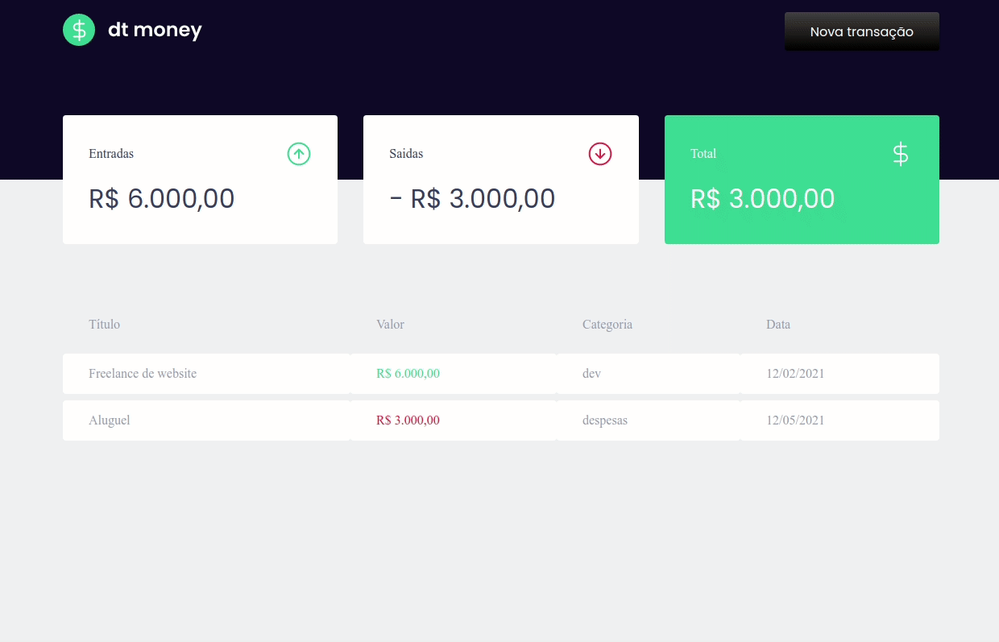
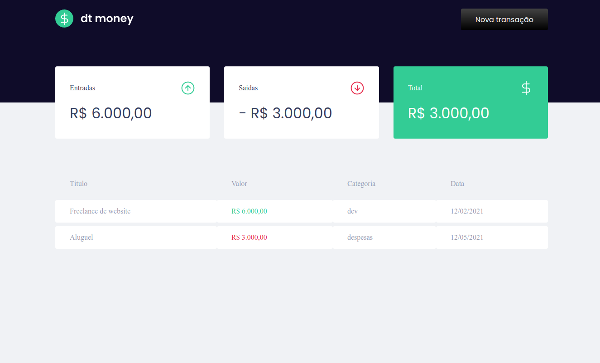
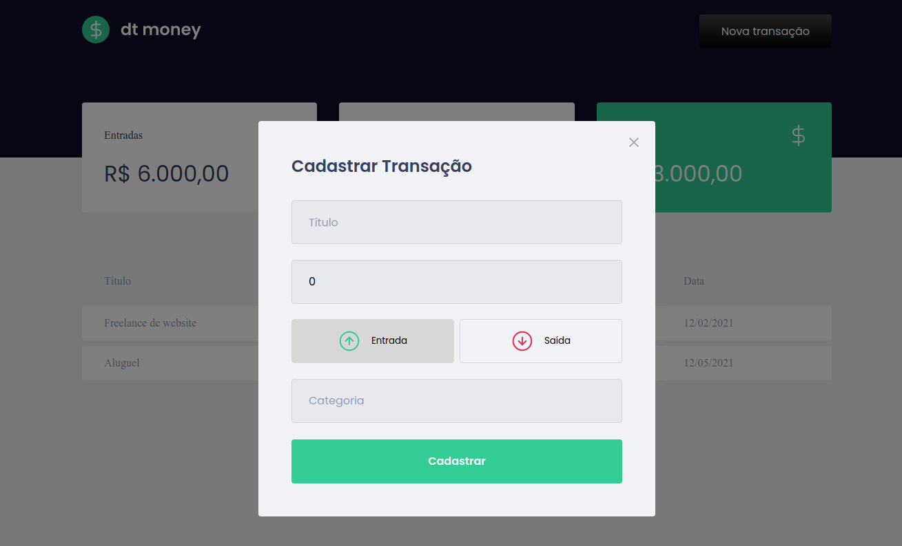
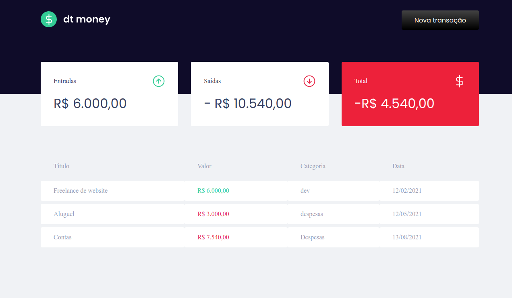

<h1 align="center">Money App</h1>
 

# :pushpin: Index
- [Project Media](#camera_flash-project-media)
- [About](#monocle_face-about)
- [Technologies](#rocket-technologies)
- [Author](#closed_book-author)
 

---
# :camera_flash: Project Media

  
  
  
  

 

---
# :monocle_face: About
This project was developed to be a financial control application. Technologies like Typescript and Styled Components were used.

In case a sequence of finances adds up positive, the total value has its background green, otherwise it becomes red.
This dynamic change was done by sharing Props between the component and the file that contains the specific Styled Components.

I hope you enjoyed it <3
 

---

# :rocket: Technologies
This project was developed with the following technologies:  
- :heavy_check_mark: **React**
- :heavy_check_mark: **Typescript**
- :heavy_check_mark: **Styled Components**
- :heavy_check_mark: **Context API**
- :heavy_check_mark: **MirageJS**
- :heavy_check_mark: **Axios**
 
 

---

# :closed_book: Author
By [Patrick Morais](https://github.com/PatrickMoraisN).
### :link: LinkedIn: https://www.linkedin.com/in/patrick-morais/
